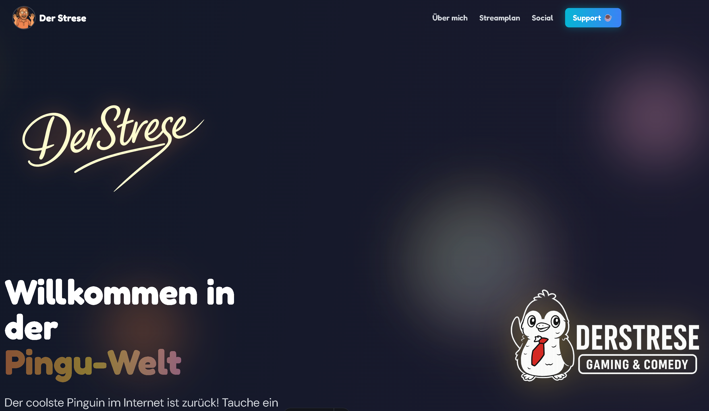

# 🐧 Der Strese - Offizielle Website

Eine moderne, interaktive Website für den coolsten Pinguin im Web - gebaut mit Astro und Tailwind CSS.



## 📸 Screenshots

<details>
<summary>Mehr Screenshots anzeigen</summary>

### Desktop-Ansicht

| Hero & About | Streamplan | Social & Support |
|-------------|------------|------------------|
|  |  |  |

### Features

| Twitch Live-Embed | Community | 404 Page |
|-------------------|-----------|----------|
|  |  |  |

### Mobile-Ansicht


</details>

## ✨ Features

- **Dunkles Design**: Atmosphärisches Dark-Mode-Design mit leuchtenden Akzenten
- **Interaktive Animationen**: Parallax-Effekte, Hover-Animationen und fließende Übergänge
- **Responsive Design**: Perfekt optimiert für alle Bildschirmgrößen
- **Performance-First**: Astro's Island-Architektur für blitzschnelle Ladezeiten
- **About-Sektion**: Informationen über Der Strese und die Chaos-Crew
- **Wöchentlicher Streamplan**: Vollständiger Wochenplan mit allen Stream-Zeiten
- **Social Media Hub**: Links zu allen Plattformen (Twitch, YouTube, Discord, Instagram, Merch)
- **Emotionen-Grid**: Asymmetrisches Layout mit allen Pinguin-Emotionen
- **Character-Showcase**: Horizontale Scroll-Galerie mit verschiedenen Outfits
- **Fun Facts**: Interessante Informationen über Der Strese

## 🚀 Schnellstart

### Entwicklungsserver starten

```bash
npm run dev
```

Die Website ist dann verfügbar unter: `http://localhost:4321`

### Build für Production

```bash
npm run build
```

### Preview der Production-Build

```bash
npm run preview
```

## 🎨 Design-Entscheidungen

### Farbpalette (Dark Mode)
- **Penguin Black** (#1A1A2E): Haupthintergrund
- **Gray 900/800**: Sekundäre Hintergründe
- **Strese Orange** (#FF8C42): Call-to-Action & Akzente
- **Strese Yellow** (#FFD93D): Highlights
- **Strese Pink** (#FFA5C9): Akzente
- **Frost** (#7DD3E8): Zusätzliche Akzente
- **White**: Text

### Typography
- **Display**: Fredoka - Verspielt und charaktervoll für Headlines
- **Body**: DM Sans - Modern und lesbar für Fließtext
- **Mono**: JetBrains Mono - Für Code-Snippets

### Animationen
- Floating Background Elements mit Parallax
- Hover-Effekte auf allen interaktiven Elementen
- Smooth Scroll für die Character-Galerie
- Intersection Observer für Scroll-Animationen

## 📁 Projektstruktur

```
StreseWebseite/
├── src/
│   ├── layouts/
│   │   └── Layout.astro       # Base Layout mit Meta-Tags und Fonts
│   └── pages/
│       └── index.astro         # Hauptseite
├── public/
│   └── assets/                 # Alle Bilder und Assets
│       ├── Pinguin/            # Pinguin-Charaktere
│       └── Schriftzug/         # Logo-Varianten
├── astro.config.mjs            # Astro-Konfiguration
├── tailwind.config.mjs         # Tailwind-Konfiguration
├── tsconfig.json               # TypeScript-Konfiguration
└── package.json

```

## 🔄 Streamplan aktualisieren

Der Streamplan wird regelmäßig aktualisiert. Um die neueste Version zu laden:

### Automatisch (Empfohlen)

**Windows:**
```bash
update-streamplan.bat
```

**Linux/Mac:**
```bash
chmod +x update-streamplan.sh
./update-streamplan.sh
```

### Manuell

1. Bild herunterladen:
```bash
curl -L -o streamplan.png "https://derstre.se/images/streamplan.png"
```

2. In public-Ordner kopieren:
```bash
cp streamplan.png public/assets/
```

3. **Wichtig:** Zeiten in `src/pages/index.astro` manuell anpassen, falls sich der Streamplan geändert hat (Suche nach `<!-- Stream Schedule Section -->`).

## 📸 Screenshots erstellen

Du kannst automatisch Screenshots für die Dokumentation erstellen:

### Automatisch (Empfohlen)

```bash
# Playwright installieren
npm install -D @playwright/test
npx playwright install

# Dev-Server starten (in einem Terminal)
npm run dev

# Screenshots erstellen (in einem anderen Terminal)
node take-screenshots.js
```

### Manuell

1. Dev-Server starten: `npm run dev`
2. Browser öffnen: `http://localhost:4321`
3. Screenshots machen und in `screenshots/` Ordner speichern
4. Empfohlene Namen: `hero.png`, `streamplan.png`, `support.png`, etc.

## 🎯 Nächste Schritte

- [ ] Screenshots erstellen und hochladen
- [ ] Weitere Seiten hinzufügen (Galerie, Kontakt)
- [ ] Lightbox für Bilder-Galerie
- [ ] Blog-Sektion für Updates
- [ ] Automatisches Streamplan-Update via API

## 🛠️ Technologie-Stack

- **Framework**: [Astro](https://astro.build) v5
- **Styling**: [Tailwind CSS](https://tailwindcss.com) v3
- **Fonts**: Google Fonts (Fredoka, DM Sans, JetBrains Mono)
- **TypeScript**: Strict Mode

## 📝 Lizenz

© 2025 Der Strese. Alle Rechte vorbehalten.

---

Made with ❄️ and 🐧 by Claude Code
